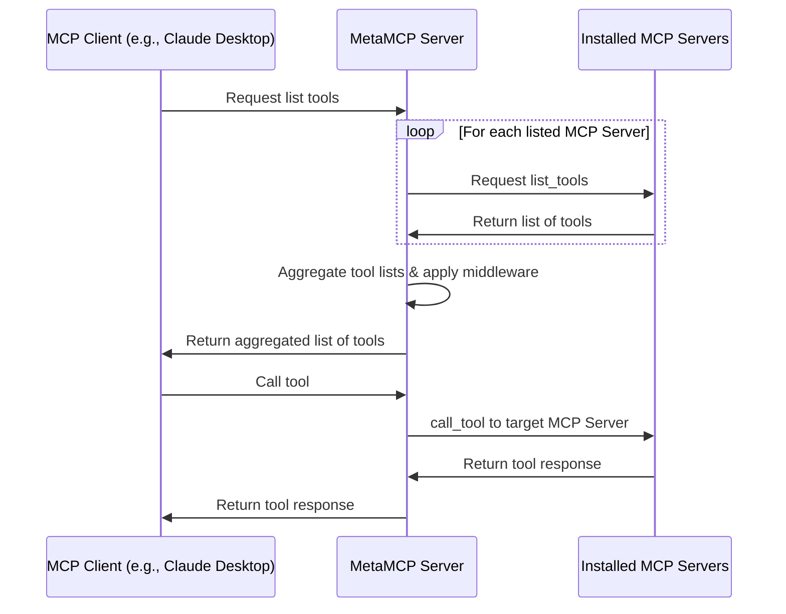

# 🚀 MetaMCP (MCP Aggregator, Orchestrator, Middleware, Gateway in one docker) <!-- omit in toc -->

<div align="center">

<div align="center">
  <a href="https://discord.gg/mNsyat7mFX" style="text-decoration: none;">
    
  </a>
  <a href="https://docs.metamcp.com" style="text-decoration: none;">
    
  </a>
  <a href="https://opensource.org/licenses/MIT" style="text-decoration: none;">
    
  </a>
  <a href="https://github.com/metatool-ai/metamcp/pkgs/container/metamcp" style="text-decoration: none;">
    
  </a>
  <a href="https://deepwiki.com/metatool-ai/metamcp"></a>
</div>

</div>

> 

**📢 Latest Update:** This ai-dev branch will be the forward onging dev branch which contains ai agent changes. Please test before you build the image based on this branch. There has been many PRs thanks to the community but merging and reviewing them has been a growing effort too. I decided to include ai changes. At least so far the core functionality works. There is also a community maintained fork (ty a lot!): https://github.com/Umbrella-IT-Group/metamcp

**📢 Update:** *[From the author: apologize for some recent maintainence delay, but will at least keep merging PRs, more background [here](recent-updates.md)]*

**MetaMCP** is a MCP proxy that lets you dynamically aggregate MCP servers into a unified MCP server, and apply middlewares. MetaMCP itself is a MCP server so it can be easily plugged into **ANY** MCP clients.


---

For more details, consider visiting our documentation site: https://docs.metamcp.com

English | [简体中文](./README_cn.md)
## 📋 Table of Contents <!-- omit in toc -->

- [🎯 Use Cases](#-use-cases)
- [📖 Concepts](#-concepts)
  - [🖥️ **MCP Server**](#️-mcp-server)
    - [🔐 **Environment Variables \& Secrets (STDIO MCP Servers)**](#-environment-variables--secrets-stdio-mcp-servers)
  - [🏷️ **MetaMCP Namespace**](#️-metamcp-namespace)
  - [🌐 **MetaMCP Endpoint**](#-metamcp-endpoint)
  - [⚙️ **Middleware**](#️-middleware)
  - [🔍 **Inspector**](#-inspector)
  - [✏️ **Tool Overrides \& Annotations**](#️-tool-overrides--annotations)
- [🚀 Quick Start](#-quick-start)
  - [🐳 Run with Docker Compose (Recommended)](#-run-with-docker-compose-recommended)
  - [📦 Build development environment with Dev Containers (VSCode/Cursor)](#-build-development-environment-with-dev-containers-vscodecursor)
  - [💻 Local Development](#-local-development)
- [🔌 MCP Protocol Compatibility](#-mcp-protocol-compatibility)
- [🔗 Connect to MetaMCP](#-connect-to-metamcp)
  - [📝 E.g., Cursor via mcp.json](#-eg-cursor-via-mcpjson)
  - [🖥️ Connecting Claude Desktop and Other STDIO-only Clients](#️-connecting-claude-desktop-and-other-stdio-only-clients)
  - [🔧 API Key Auth Troubleshooting](#-api-key-auth-troubleshooting)
- [❄️ Cold Start Problem and Custom Dockerfile](#️-cold-start-problem-and-custom-dockerfile)
- [🧾 Log Levels](#-log-levels)
- [📎 Direct File Transfers (Telegram → Google Drive, without burning tokens)](#-direct-file-transfers-telegram--google-drive-without-burning-tokens)
- [💬 One-Click Telegram Connector](#-one-click-telegram-connector)
- [📸 One-Click Instagram Connector](#-one-click-instagram-connector)
- [🔐 Authentication](#-authentication)
- [🚦 Traffic Management](#-traffic-management)
  - [🚧 **MCP Rate Limit**](#-mcp-rate-limit)
- [🔗 OpenID Connect (OIDC) Provider Support](#-openid-connect-oidc-provider-support)
  - [🛠️ **Configuration**](#️-configuration)
  - [🏢 **Supported Providers**](#-supported-providers)
  - [🔒 **Security Features**](#-security-features)
  - [📱 **Usage**](#-usage)
- [⚙️ Registration Controls](#️-registration-controls)
  - [🎛️ **Available Controls**](#️-available-controls)
  - [🏢 **Enterprise Use Cases**](#-enterprise-use-cases)
  - [🛠️ **Configuration**](#️-configuration-1)
- [🌐 Custom Deployment and SSE conf for Nginx](#-custom-deployment-and-sse-conf-for-nginx)
- [🏗️ Architecture](#️-architecture)
  - [📊 Sequence Diagram](#-sequence-diagram)
- [🗺️ Roadmap](#️-roadmap)
- [🌐 i18n](#-i18n)
- [🤝 Contributing](#-contributing)
- [📄 License](#-license)
- [🙏 Credits](#-credits)

## 🎯 Use Cases
- 🏷️ **Group MCP servers into namespaces, host them as meta-MCPs, and assign public endpoints** (SSE or Streamable HTTP), with auth. One-click to switch a namespace for an endpoint.
-  🎯 **Pick tools you only need when remixing MCP servers.** Apply other **pluggable middleware** around observability, security, etc. (coming soon)
-  🔍 **Use as enhanced MCP inspector** with saved server configs, and inspect your MetaMCP endpoints in house to see if it works or not.
-  🔍 **Use as Elasticsearch for MCP tool selection** (coming soon)

Generally developers can use MetaMCP as **infrastructure** to host dynamically composed MCP servers through a unified endpoint, and build agents on top of it.

Quick demo video: https://youtu.be/Cf6jVd2saAs


## 📖 Concepts

### 🖥️ **MCP Server**
A MCP server configuration that tells MetaMCP how to start a MCP server.

```json
"HackerNews": {
  "type": "STDIO",
  "command": "uvx",
  "args": ["mcp-hn"]
}
```

#### 🔐 **Environment Variables & Secrets (STDIO MCP Servers)**

For **STDIO MCP servers**, MetaMCP supports three ways to handle environment variables and secrets:

**1. Raw Values** - Direct string values (not recommended for secrets):
```
API_KEY=your-actual-api-key-here
DEBUG=true
```

**2. Environment Variable References** - Use `${ENV_VAR_NAME}` syntax:
```
API_KEY=${OPENAI_API_KEY}
DATABASE_URL=${DB_CONNECTION_STRING}
```

**3. Auto-matching** - If the expected environment variable name in your tool matches the container's environment variable, you can omit it entirely. MetaMCP will automatically pass through matching environment variables.

> **🔒 Security Note**: Environment variable references (`${VAR_NAME}`) are resolved from the MetaMCP container's environment at runtime. This keeps actual secret values out of your configuration and git repository.

> **⚙️ Development Note**: For local development with `pnpm run dev:docker`, ensure your environment variables are listed in `turbo.json` under `globalEnv` to be passed to the development processes. This is not required for production Docker deployments.

### 🏷️ **MetaMCP Namespace**
- Group one or more MCP servers into a namespace
- Enable/disable MCP servers or at tool level
- Apply middlewares to MCP requests and responses
- Override tool names/titles/descriptions per namespace and attach custom MCP annotations (e.g. `{ "annotations": { "readOnlyHint": false } }`)

### 🌐 **MetaMCP Endpoint**
- Create endpoints and assign namespace to endpoints
- Multiple MCP servers in the namespace will be aggregated and emitted as a MetaMCP endpoint
- Choose between API-Key Auth (in header or query param) or standard OAuth in MCP Spec 2025-06-18
- Host through **SSE** or **Streamable HTTP** transports in MCP and **OpenAPI** endpoints for clients like [Open WebUI](https://github.com/open-webui/open-webui)

### ⚙️ **Middleware**
- Intercepts and transforms MCP requests and responses at namespace level
- **Built-in example**: "Filter inactive tools" - optimizes tool context for LLMs
- **Future ideas**: tool logging, error traces, validation, scanning

### 🔍 **Inspector**
Similar to the official MCP inspector, but with **saved server configs** - MetaMCP automatically creates configurations so you can debug MetaMCP endpoints immediately.

### ✏️ **Tool Overrides & Annotations**
- Open a namespace → **Tools** tab to see every tool coming from connected MCP servers.
- Each saved tool can be expanded and edited inline: update the display **name/title/description** or provide a JSON blob with namespace-specific annotations (for example `{ "annotations": { "readOnlyHint": false } }`).
- Badges in the table ("Overridden", "Annotations") show which tools currently have custom metadata. Hover them to read a tooltip describing what was overridden.
- Annotation overrides are merged with whatever the upstream MCP server returns, so you can safely add custom UI hints without losing provider metadata.

## 🚀 Quick Start

### **🐳 Run with Docker Compose (Recommended)**

Clone repo, prepare `.env`, and start with docker compose:

```bash
git clone https://github.com/metatool-ai/metamcp.git
cd metamcp
cp example.env .env
docker compose up -d
```

If you modify APP_URL env vars, make sure you only access from the APP_URL, because MetaMCP enforces CORS policy on the URL, so no other URL is accessible.

Note that the pg volume name may collide with your other pg dockers, which is global, consider rename it in `docker-compose.yml`:

```
volumes:
  metamcp_postgres_data:
    driver: local
```

### **📦 Build development environment with Dev Containers (VSCode/Cursor)**

You can use the VSCode/Cursor extension to build the development environment in a container.

It only requires that you have an environment running Docker or a similar alternative (the `docker`/`docker compose` command is required), and no other dependent components need to be installed on your host machine.

1. First, clone the MetaMCP source code, open project in Visual Studio Code.
```bash
git clone https://github.com/metatool-ai/metamcp.git
cd metamcp
code .
```
2. Switch to Dev Containers. Open the VSCode Command Palette, and execute `Dev Containers: Reopen in Container`.

VSCode will open the Dev Containers project in a new window, where it will build the runtime and install the toolchain according to the `Dockerfile` before starting the connection and finally installing the MetaMCP dependencies.


> **note**
> This process requires a reliable network connection, and it will access Docker Hub, GitHub, and some other sites. You will need to ensure the network connection yourself, otherwise the container build may fail.

Wait some minutes, depending on the internet connection or computer performance, it may take from a few minutes to tens of minutes, you can click on the Progress Bar in the bottom right corner to view a live log where you will be able to check unusual stuck.


After finished, you can run `pnpm dev` to start the development server.

### **💻 Local Development**

Still recommend running postgres through docker for easy setup:

```bash
pnpm install
pnpm dev
```

## 🔌 MCP Protocol Compatibility

- ✅ **Tools, Resources, and Prompts** supported
- ✅ **OAuth-enabled MCP servers** tested for 03-26 version

If you have questions, feel free to leave **GitHub issues** or **PRs**.

## 🔗 Connect to MetaMCP

### 📝 E.g., Cursor via mcp.json

Example `mcp.json`

```json
{
  "mcpServers": {
    "MetaMCP": {
      "url": "http://localhost:12008/metamcp/<YOUR_ENDPOINT_NAME>/sse"
    }
  }
}
```

### 🖥️ Connecting Claude Desktop and Other STDIO-only Clients

Since MetaMCP endpoints are remote only (SSE, Streamable HTTP, OpenAPI), clients that only support stdio servers (like Claude Desktop) need a local proxy to connect.

**Note:** While `mcp-remote` is sometimes suggested for this purpose, it's designed for OAuth-based authentication and doesn't work with MetaMCP's API key authentication. Based on testing, `mcp-proxy` is the recommended solution.

Here's a working configuration for Claude Desktop using `mcp-proxy`:

Using Streamable HTTP

```json
{
  "mcpServers": {
    "MetaMCP": {
      "command": "uvx",
      "args": [
        "mcp-proxy",
        "--transport",
        "streamablehttp",
        "http://localhost:12008/metamcp/<YOUR_ENDPOINT_NAME>/mcp"
      ],
      "env": {
        "API_ACCESS_TOKEN": "<YOUR_API_KEY_HERE>"
      }
    }
  }
}
```

Using SSE

```json
{
  "mcpServers": {
    "ehn": {
      "command": "uvx",
      "args": [
        "mcp-proxy",
        "http://localhost:12008/metamcp/<YOUR_ENDPOINT_NAME>/sse"
      ],
      "env": {
        "API_ACCESS_TOKEN": "<YOUR_API_KEY_HERE>"
      }
    }
  }
}
```

**Important notes:**
- Replace `<YOUR_ENDPOINT_NAME>` with your actual endpoint name
- Replace `<YOUR_API_KEY_HERE>` with your MetaMCP API key (format: `sk_mt_...`)

For more details and alternative approaches, see [issue #76](https://github.com/metatool-ai/metamcp/issues/76#issuecomment-3046707532).

### 🔧 API Key Auth Troubleshooting

- `?api_key=` param api key auth doesn't work for SSE. It only works for Streamable HTTP and OpenAPI.
- Best practice is to use the API key in `Authorization: Bearer <API_KEY>` header.
- Try disable auth temporarily when you face connection issues to see if it is an auth issue.

## ❄️ Cold Start Problem and Custom Dockerfile

- MetaMCP pre-allocate idle sessions for each configured MCP servers and MetaMCPs. The default idle session for each is 1 and that can help reduce cold start time.
- If your MCP requires dependencies other than `uvx` or `npx`, you need to customize the Dockerfile to install dependencies on your own.
- Check [invalidation.md](invalidation.md) for a seq diagram about how idle session invalidates during updates.

🛠️ **Solution**: Customize the Dockerfile to add dependencies or pre-install packages to reduce cold start time.

## 🧾 Log Levels

MetaMCP’s backend writes logs to files and optionally mirrors selected levels to the console. Control console mirroring with the `LOG_LEVEL` environment variable.

- Files
  - `app.log`: receives `DEBUG`, `INFO`, and `WARN`
  - `error.log`: receives `ERROR`

- Console mirroring (`LOG_LEVEL`)
  - `all`: mirror `DEBUG`, `INFO`, `WARN`, `ERROR` to console
  - `info`: mirror only `INFO` to console
  - `errors-only`: mirror `WARN` and `ERROR` to console
  - `none`: no console output

- Defaults and examples
  - Default (when unset or invalid): `errors-only`
  - `.env` example:
    ```bash
    LOG_LEVEL='errors-only' # 'all', 'info', 'errors-only', 'none'
    ```
  - `docker-compose.dev.yml` uses: `LOG_LEVEL: ${LOG_LEVEL:-all}`

## 📎 Direct File Transfers (Telegram → Google Drive, without burning tokens)

Moving a file between two MCP servers normally costs a fortune in tokens: the client calls
`download_media`, the file comes back as base64 **inside the conversation**, and the client
sends those same bytes back out to the upload tool. A 20 MB attachment is roughly 27 MB of
base64 — tens of thousands of tokens, twice, for bytes no model ever needs to read.

MetaMCP's built-in **file relay** does the copy inside the server instead. The bytes go
`source → MetaMCP disk → destination` and never enter the context window; the client only
sees a small JSON summary (name, MIME type, size, sha256, destination link).

The relay is enabled by default and appears in every namespace as three tools, plus a fourth
once Google Drive is configured:

| Tool | What it does |
| --- | --- |
| `metamcp-files__transfer_file` | Source → destination in one call. This is the one you normally want. |
| `metamcp-files__stage_file` | Pull the file into MetaMCP's staging area, return only its metadata + a handle. |
| `metamcp-files__deliver_file` | Send a previously staged handle to a destination. |
| `metamcp-files__create_drive_upload_session` | Open a Drive upload session and hand back the URI, so the caller can PUT the bytes itself. |

**Sources** (pick exactly one): `telegram` (a Bot API `file_id`), `tool` (any tool of the same
namespace), `url` (any http(s) URL).
**Destinations** (pick exactly one): `googleDrive` (native upload with the server's
credentials), `tool` (any tool of the same namespace, with the payload injected as base64,
a data URL or text).

### 🚀 Telegram → Google Drive

With `TELEGRAM_BOT_TOKEN` and Google Drive credentials configured, the whole transfer is a
single call whose arguments contain no file data at all:

```json
{
  "name": "metamcp-files__transfer_file",
  "arguments": {
    "source": { "telegram": { "fileId": "BQACAgIAAxkBAAI..." } },
    "destination": { "googleDrive": { "folderId": "1AbC...", "fileName": "invoice.pdf" } }
  }
}
```

The reply is just:

```json
{
  "ok": true,
  "file": { "fileName": "invoice.pdf", "mimeType": "application/pdf", "size": 2317441, "sha256": "…" },
  "destination": {
    "kind": "googleDrive",
    "googleDrive": { "id": "1XyZ…", "webViewLink": "https://drive.google.com/file/d/1XyZ…/view" }
  },
  "note": "2317441 bytes were relayed server-side and never entered the conversation."
}
```

### ⬆️ Sandbox → Google Drive (the file MetaMCP cannot reach)

The relay can only move a file it can fetch. When the bytes sit on a disk MetaMCP has no
access to — an agent's sandbox, a CI runner, your own laptop — ask for an upload session
instead and do the PUT yourself:

```json
{
  "name": "metamcp-files__create_drive_upload_session",
  "arguments": {
    "folderId": "1AbC...",
    "fileName": "report.pdf",
    "mimeType": "application/pdf"
  }
}
```

```json
{
  "ok": true,
  "uploadUri": "https://storage.googleapis.com/upload/drive/v3/files?uploadType=resumable&upload_id=…",
  "file": { "fileName": "report.pdf", "mimeType": "application/pdf", "folderId": "1AbC..." },
  "upload": "curl -X PUT --data-binary @<file> -H 'Content-Type: application/pdf' '…'"
}
```

One `curl -X PUT --data-binary @report.pdf '<uploadUri>'` later, Google itself answers with
the finished file's JSON — `id` and `webViewLink` included, because the `fields` were set when
the session was opened.

Why this is worth a tool of its own: the bytes go **straight from wherever they are to
Google**, with no third party in between and no copy on MetaMCP's disk. The session URI is a
single-use credential scoped to that one file, valid for about a week, and it needs no
`Authorization` header — so the server's refresh token or service-account key never leaves
the server, and nothing long-lived ends up in a conversation. The tool is only listed when
Drive credentials are configured.

### 🔁 Any MCP tool → any MCP tool

When the file lives behind an MCP server rather than the Bot API (a Telegram MCP server, an
email server, a scraper), name the tool instead. The relay calls it, keeps the binary result
server-side, and forwards it:

```json
{
  "source": {
    "tool": {
      "name": "Telegram__download_media",
      "arguments": { "chat_id": 123456, "message_id": 42 }
    }
  },
  "destination": {
    "tool": {
      "name": "Google-Drive__create_file",
      "contentArgument": "content",
      "contentEncoding": "base64",
      "arguments": { "name": "{{file.name}}", "parentId": "1AbC..." },
      "mimeTypeArgument": "mimeType"
    }
  }
}
```

The relay understands the usual ways servers return a file: `image` / `audio` content,
`resource` blobs, `resource_link`s, data URLs, JSON replies carrying a download URL, and a
path mentioned in prose (`Media downloaded to /tmp/downloads/x.pdf.`) — the last one only for
directories listed in `FILE_RELAY_LOCAL_PATH_ROOTS`. If
auto-detection fails, point at the URL explicitly with `source.tool.urlPath`
(e.g. `"result.file_url"`). `{{file.name}}`, `{{file.mimeType}}`, `{{file.size}}`,
`{{file.sha256}}` and `{{env.ALLOWED_NAME}}` can be templated anywhere in the destination
arguments, so secrets stay on the server too.

Relayed calls go back through the normal middleware chain, so tool filtering, tool overrides
and audit logging apply exactly as they would to a direct call.

### ⚙️ Configuration

| Variable | Default | Purpose |
| --- | --- | --- |
| `FILE_RELAY_ENABLED` | `true` | Set to `false` to hide the relay tools entirely. |
| `FILE_RELAY_MAX_BYTES` | `104857600` (100 MiB) | Hard size cap per transfer. |
| `FILE_RELAY_STAGING_DIR` | `$TMPDIR/metamcp-file-relay` | Where in-flight files are written. |
| `FILE_RELAY_TTL_MS` | `3600000` (1 h) | How long a staged file survives before being swept. |
| `FILE_RELAY_ALLOWED_HOSTS` | *(empty = any public host)* | Comma-separated allow-list for `url` sources. |
| `FILE_RELAY_ALLOW_PRIVATE_HOSTS` | `false` | Allow `url` sources to resolve to private/loopback addresses. |
| `FILE_RELAY_SECRET_ENV` | *(empty)* | Env var names that may be used as `{{env.NAME}}`. |
| `FILE_RELAY_LOCAL_PATH_ROOTS` | *(empty = disabled)* | Directories a source result may point into with a local path. Needed for STDIO servers that save media to disk and answer with the path — e.g. `/tmp/downloads` for a Telethon-based Telegram server. |
| `FILE_RELAY_MAX_RESULT_TEXT_CHARS` | `2000` | Truncation budget for text echoed back from a destination tool. |
| `TELEGRAM_BOT_TOKEN` | – | Enables `source.telegram`. |
| `TELEGRAM_API_BASE` | `https://api.telegram.org` | Point at a self-hosted Bot API server. |
| `GOOGLE_DRIVE_CLIENT_ID` / `GOOGLE_DRIVE_CLIENT_SECRET` / `GOOGLE_DRIVE_REFRESH_TOKEN` | – | Drive credentials (user OAuth). |
| `GOOGLE_DRIVE_SERVICE_ACCOUNT_JSON` | – | Drive credentials (service account, alternative to the above). |
| `GOOGLE_DRIVE_SUBJECT` | – | User to impersonate with a domain-wide-delegation service account. |
| `GOOGLE_DRIVE_SCOPE` | `…/auth/drive.file` | Scope requested for service-account credentials. |
| `GOOGLE_DRIVE_DEFAULT_FOLDER_ID` | – | Folder used when a Drive destination does not name one. |
| `GOOGLE_DRIVE_REDIRECT_URI` | `$APP_URL/file-relay/google/callback` | Redirect registered on the OAuth client for the per-user **Connect Drive** button. |

### 👤 Per-user connections

Everything in the table above is **deployment-wide**: those credentials belong to the
operator, and a request uses them only when the account behind it has connected nothing of
its own.

Each user can instead connect their own Telegram bot and their own Google Drive under
**Settings → File relay connections**:

- **Connect bot** — paste a token from [@BotFather](https://t.me/BotFather). MetaMCP verifies
  it against the Bot API before storing it and shows the bot's `@username`.
- **Connect Drive** — sends the user to Google's consent screen and stores the refresh token
  that comes back. This button needs `GOOGLE_DRIVE_CLIENT_ID` and
  `GOOGLE_DRIVE_CLIENT_SECRET` (the OAuth *client* is the operator's; each user's *grant* is
  their own), with `$APP_URL/file-relay/google/callback` registered as an authorized redirect
  URI.

**One user can never use another's credentials or authorized tools.** The account the relay acts as is fixed by
the API key, the OAuth token, or the endpoint — never by anything the caller sends:

- Credentials are read and written only by user id — there is no lookup that returns a row
  without one.
- Access tokens are cached per credential, so a token minted for one Drive grant is never
  served to another.
- An endpoint with auth off acts as **the endpoint's own owner**, not as whoever called it.
  Such an endpoint is reached by knowing its URL and already serves that owner's MCP
  servers, so the relay acting as the same owner adds no reach; an endpoint with no owner
  at all gets no user credentials and falls back to the deployment-wide ones.
- `tools/list` is resolved per caller: a user with no Drive is not offered the Drive tool.
- The Google callback is public by necessity (Google redirects a browser to it), so the
  account is decided by a single-use, ten-minute, 256-bit `state` bound to the user who
  pressed Connect — never by anything in the request.
- Secrets are write-only from the browser's point of view: the settings page only ever
  receives a label and a timestamp.

### 🔑 Connecting Google Drive

This section sets up the **deployment-wide** Drive — the fallback for accounts that have not
connected one of their own (see *Per-user connections* above). Pick one of the two credential
types.

**Personal account / Gmail — OAuth refresh token (recommended):**

1. In [Google Cloud Console](https://console.cloud.google.com/), create (or pick) a project
   and enable the **Google Drive API** under *APIs & Services → Library*.
2. *APIs & Services → OAuth consent screen*: choose **External**, fill in the app name and
   your own email, and add yourself under **Test users**. Then press **Publish app**: while
   the consent screen stays in *Testing*, Google expires every refresh token after 7 days,
   which would break the relay each week. A published app used only by its owner does not
   need Google's verification review for this to work.
3. *APIs & Services → Credentials → Create credentials → OAuth client ID*, application type
   **Web application**, and add `http://localhost:53682` as an **Authorized redirect URI**.
4. Run the helper from the repo root and open the URL it prints:

   ```bash
   node scripts/google-drive-auth.mjs --client-id <id> --client-secret <secret>
   # uploading into a folder you did not create with this app:
   node scripts/google-drive-auth.mjs --scope drive
   ```

   It listens on `127.0.0.1`, catches Google's callback and prints the three `.env` lines.
5. Paste them into `.env`, add `GOOGLE_DRIVE_DEFAULT_FOLDER_ID` if you want a default target
   folder (the ID is the last path segment of the folder's URL:
   `https://drive.google.com/drive/folders/`**`1AbCdEf...`**), then restart MetaMCP
   (`docker compose up -d`).

**Google Workspace — service account:**

1. Create a service account, generate a JSON key, and put it in
   `GOOGLE_DRIVE_SERVICE_ACCOUNT_JSON` as a single line.
2. Either share the target folder with the service account's email address (works for a
   **Shared Drive**), or enable domain-wide delegation and set `GOOGLE_DRIVE_SUBJECT` to the
   user to impersonate.
3. Set `GOOGLE_DRIVE_SCOPE=https://www.googleapis.com/auth/drive` when the target folder was
   not created by the relay itself.

A service account has no storage quota of its own: uploading into a folder in someone's
personal *My Drive* fails with `Service Accounts do not have storage quota`. Use a Shared
Drive, impersonation, or the refresh-token flow instead.

**Scopes.** `drive.file` (the default) only reaches files the relay created, which is the
right least-privilege choice when you let it upload into *My Drive* root or into folders it
created. Targeting a pre-existing folder by ID needs the broader
`https://www.googleapis.com/auth/drive`.

**Check it worked.** Before involving MCP at all, run the credential check — it fetches a
token, uploads a tiny file through the same resumable path the relay uses, and deletes it
again:

```bash
node scripts/google-drive-check.mjs                      # into My Drive
node scripts/google-drive-check.mjs --folder-id 1AbC...  # into a specific folder
```

It names the failure when something is off: a revoked refresh token, a folder the scope
cannot see, or a service account with no storage quota.

Then restart MetaMCP and reconnect your MCP client: the description of
`metamcp-files__transfer_file` ends with "Google Drive is configured on this server" once the
credentials are picked up. Note that partial OAuth settings count as *not configured* — all
three of `GOOGLE_DRIVE_CLIENT_ID`, `GOOGLE_DRIVE_CLIENT_SECRET` and
`GOOGLE_DRIVE_REFRESH_TOKEN` must be present.

### 🔒 Notes on safety

- `url` sources are checked before every request and after every redirect: only http(s), never
  loopback / RFC1918 / link-local addresses (cloud metadata included) unless
  `FILE_RELAY_ALLOW_PRIVATE_HOSTS=true`, and optionally restricted to `FILE_RELAY_ALLOWED_HOSTS`.
- `{{env.…}}` only resolves names listed in `FILE_RELAY_SECRET_ENV`, so a client cannot template
  the database URL into an outbound request.
- Local filesystem paths returned by a source tool are refused unless they resolve inside
  `FILE_RELAY_LOCAL_PATH_ROOTS`.
- Staged files live in a `0700` directory, are deleted as soon as delivery finishes, and expire
  on a timer if a transfer is abandoned.

## 💬 One-Click Telegram Connector

Connecting a Telegram **user account** to an MCP server normally means cloning the server's
repo, running its interactive `session_string_generator.py`, typing a phone number, a login
code and a cloud password into a terminal, then copy-pasting the resulting session string into
MetaMCP by hand.

**MCP Servers → Connect Telegram** does all of that in the browser:

1. Enter the connector's name. The Telegram `api_id` / `api_hash` come from the backend's
   environment (see below); the dialog asks for them only when the deployment has none, or
   when you choose a different application for this one login.
2. MetaMCP opens an MTProto QR login and shows the code. Scan it in Telegram
   (**Settings → Devices → Link Desktop Device**); the code refreshes itself until you do.
3. If the account has two-step verification, MetaMCP asks for the cloud password and completes
   the login with it.
4. Confirm the account it signed in as, and the STDIO MCP server is created with

   ```
   TELEGRAM_API_ID, TELEGRAM_API_HASH, TELEGRAM_SESSION_STRING
   ```

   already filled in — the same variables `chigwell/telegram-mcp` and other Telethon-based
   Telegram MCP servers read. The command defaults to `telegram-mcp` (the launcher baked into
   the all-in-one image) and can be changed under **Advanced settings**.

The session string is written in Telethon's own `StringSession` format, so it drops straight
into a Python Telegram MCP server.

**Configuring the application.** Register one app at
[my.telegram.org/apps](https://my.telegram.org/apps) and give the MetaMCP backend:

| Variable | Meaning |
| --- | --- |
| `TELEGRAM_API_ID` | The application's numeric ID. |
| `TELEGRAM_API_HASH` | The application's 32-character hex hash. |

With both set, every user of this MetaMCP only has to scan a QR — and the `api_hash` never
leaves the backend. Set only one of the two and the dialog says so rather than quietly falling
back. With neither set the connector still works: each user enters their own credentials in the
dialog. These are the same variable names the Telegram MCP servers read, so a deployment
declares the application once.

**Security notes.** The login runs entirely in the backend: the browser only ever receives the
QR image and the current phase, never the MTProto auth key or the session string. A login is
bound to the MetaMCP user who started it, is dropped after 10 minutes of inactivity, and its
session string can be spent on exactly one MCP server. Closing the dialog cancels the login and
disconnects it — MetaMCP never calls `auth.logOut`, so the credential handed to the MCP server
stays valid. The session string is an account credential with the same power as the account
itself; it is stored in the server's environment variables like any other MCP secret.

## 📸 One-Click Instagram Connector

The Instagram MCP server authenticates with the three cookies a logged-in browser holds
(`sessionid`, `csrftoken`, `ds_user_id`), which normally means a trip through devtools:
Application → Cookies → copy three values by hand into a server config.

**MCP Servers → Connect Instagram** does the sign-in instead:

1. Enter the connector's name and the account's username and password.
2. MetaMCP signs in to instagram.com from the backend. If the account has two-factor
   authentication on, it asks for the code (from the authenticator app, or the SMS Instagram
   just sent — the dialog says which).
3. Confirm the account, and the STDIO MCP server is created with

   ```
   INSTAGRAM_SESSION_ID, INSTAGRAM_CSRF_TOKEN, INSTAGRAM_DS_USER_ID
   ```

   already filled in. The command defaults to `mcp-instagram-dm` (the package baked into the
   all-in-one image) and can be changed under **Advanced settings**.

**Two-factor accounts.** Instagram sends nothing until a delivery channel is chosen, which is
why a connector that only submits codes leaves you waiting on a silent phone. The dialog asks
first: it lists the channels the account actually has — text, WhatsApp, email, authenticator
app, backup code — and the one you pick is what MetaMCP asks Instagram to send on. The code box
stays disabled until a code is genuinely in hand.

The sign-in drives the same three GraphQL mutations instagram.com does — `useCDSWebLoginMutation`,
`useTwoStepVerificationSendCodeMutation`, `useTwoFactorLoginValidateCodeMutation` — with the
password sealed the way the browser seals it: a one-off AES-256-GCM key inside a libsodium
sealed box addressed to the Curve25519 key Instagram inlines in the login page. Those mutations
are addressed by persisted-query ids, which Instagram rotates when it ships a new web client;
they live together in `PERSISTED_QUERIES` in `apps/backend/src/lib/instagram/graphql-login.ts`.
When one goes stale the dialog says the sign-in can no longer run and points at the cookie
option, rather than reporting it as a login failure. Refreshing them means recording a login in
a browser and reading the new `doc_id` values off the three requests.

**When Instagram refuses.** A sign-in from a server's IP is an unfamiliar login, so Instagram
may answer with a checkpoint ("we noticed an unusual login") or with a rate limit instead of a
session. The dialog reports which of the two happened and offers the other path: **paste
cookies from your browser** builds the same connector from the three values of a session you
are already signed in to. That path always works, because the login already happened where
Instagram expects it — and it is the way through for any account whose code has to be
delivered.

**Security notes.** The password is used for exactly one request and is never stored — MetaMCP
keeps only the cookies Instagram hands back, and those go into the server's environment
variables without passing through the browser. A login is bound to the MetaMCP user who
started it, is dropped after 10 minutes of inactivity, and can be spent on exactly one MCP
server. The `sessionid` cookie is an account credential with the same power as the account
itself; treat it like any other MCP secret.

## 🔐 Authentication

- 🛡️ **Better Auth** for frontend & backend (TRPC procedures)
- 🍪 **Session cookies** enforce secure internal MCP proxy connections
- 🔑 **API key authentication** for external access via `Authorization: Bearer <api-key>` header
- 🪪 **MCP OAuth**: Exposed endpoints have options to use standard OAuth in MCP Spec 2025-06-18, easy to connect.
- 🏢 **Multi-tenancy**: Designed for organizations to deploy on their own machines. Supports both private and public access scopes. Users can create MCPs, namespaces, endpoints, and API keys for themselves or for everyone. Public API keys cannot access private MetaMCPs.
- ⚙️ **Separate Registration Controls**: Administrators can independently control UI registration and SSO/OAuth registration through the settings page, allowing for flexible enterprise deployment scenarios.

## 🚦 Traffic Management

### 🚧 MCP Rate Limit
The MCP Rate Limit feature allows you to set the maximum requests a MCP tool (a endpoint) will accept in a given time window. There are two different strategies to set limits that you can use separately or together:

 * `Endpoint rate-limiting (Rate Limiting)`: applies simultaneously to all clients using the endpoint, sharing a unique counter.
 * `User rate-limiting (Client Rate Limiting)`: sets a counter to each individual user.

Both types can coexist and they complement each other, and store the counters in-memory. On a cluster, each machine sees and counts only its passing traffic.

### **Endpoint rate-limiting**
The endpoint rate limit acts on the number of simultaneous transactions an endpoint can process. This type of limit protects the service for all customers.
When the users connected to an endpoint together exceed the `rate-limiting`, MetaMCP starts to reject connections with a status code `503 Service Unavailable`.

#### **Endpoint rate-limiting options**
 * `Max Rate`: Defines how many requests will you accept from all users together at any given instant. When the gateway starts, the bucket is full. As requests from users come, the remaining tokens in the bucket decrease. At the same time, the rate-limiting refills the bucket at the desired rate until its maximum capacity is reached.
 * `Max Rate Seconds`: Time period in which the maximum rates operate in seconds. For instance, if you set an max rate seconds of 60s and a rate-limiting of 5, you are allowing 5 requests every sixty seconds.

### **User rate-limiting**
The client or user rate limit applies one counter to each individual user and endpoint. When a single user connected to an endpoint exceeds their `client-max-rate`, MetaMCP starts rejecting connections with a status code `429 Too Many Requests`

#### **User rate-limiting options**
 * `Client Max Rate`: Number of tokens you add to the Token Bucket for each individual user (user quota) in the time interval you want (Client Max Rate Seconds). The remaining tokens in the bucket are the requests a specific user can do.
 * `Client Max Rate Seconds`: Time period in which the maximum rates operate in seconds. For instance, if you set an every of 60s and a rate of 5, you are allowing 5 requests every sixty seconds.
 * `Client Max Rate Strategy`: Sets the strategy you will use to set client counters. Choose ip when the restrictions apply to the client’s IP address, or set it to header when there is a header that identifies a user uniquely. That header must be defined with the key entry.
 * `Client Max Rate Strategy Key`: It is the header name containing the user identification (e.g., Authorization on tokens, or X-Original-Forwarded-For for IPs).

## 🔗 OpenID Connect (OIDC) Provider Support

MetaMCP supports **OpenID Connect authentication** for enterprise SSO integration. This allows organizations to use their existing identity providers (Auth0, Keycloak, Azure AD, etc.) for authentication.

### 🛠️ **Configuration**

Add the following environment variables to your `.env` file:

```bash
# Required
OIDC_CLIENT_ID=your-oidc-client-id
OIDC_CLIENT_SECRET=your-oidc-client-secret
OIDC_DISCOVERY_URL=https://your-provider.com/.well-known/openid-configuration

# Optional customization
OIDC_PROVIDER_ID=oidc
OIDC_SCOPES=openid email profile
OIDC_PKCE=true
```

### 🏢 **Supported Providers**

MetaMCP has been tested with popular OIDC providers:

- **Auth0**: `https://your-domain.auth0.com/.well-known/openid-configuration`
- **Keycloak**: `https://your-keycloak.com/realms/your-realm/.well-known/openid-configuration`
- **Azure AD**: `https://login.microsoftonline.com/your-tenant-id/v2.0/.well-known/openid-configuration`
- **Google**: `https://accounts.google.com/.well-known/openid-configuration`
- **Okta**: `https://your-domain.okta.com/.well-known/openid-configuration`

### 🔒 **Security Features**

- 🔐 **PKCE (Proof Key for Code Exchange)** enabled by default
- 🛡️ **Authorization Code Flow** with automatic user creation
- 🔄 **Auto-discovery** of OIDC endpoints
- 🍪 **Seamless session management** with existing auth system

### 📱 **Usage**

Once configured, users will see a **"Sign in with OIDC"** button on the login page alongside the email/password form. The authentication flow automatically creates new users on first login.

For more detailed configuration examples and troubleshooting, see **[CONTRIBUTING.md](CONTRIBUTING.md#openid-connect-oidc-provider-setup)**.

## ⚙️ Registration Controls

MetaMCP provides **separate controls** for different registration methods, allowing administrators to fine-tune user access policies for enterprise deployments.

### 🎛️ **Available Controls**

- **UI Registration**: Controls whether users can create accounts via the registration form
- **SSO Registration**: Controls whether users can create accounts via SSO/OAuth providers (OIDC, etc.)

### 🏢 **Enterprise Use Cases**

This separation enables common enterprise scenarios:

- **Block UI registration, allow SSO**: Prevent manual signups while allowing corporate SSO users
- **Block SSO registration, allow UI**: Allow manual signups while restricting SSO access
- **Block both**: Completely disable new user registration
- **Allow both**: Default behavior for open deployments

### 🛠️ **Configuration**

Access the **Settings** page in the MetaMCP admin interface to configure these controls:

1. Navigate to **Settings** → **Authentication Settings**
2. Toggle **"Disable UI Registration"** to control form-based signups
3. Toggle **"Disable SSO Registration"** to control OAuth/OIDC signups

Both controls work independently, giving you full flexibility over your registration policy.

## 🌐 Custom Deployment and SSE conf for Nginx

If you want to deploy it to a online service or a VPS, a instance of at least 2GB-4GB of memory is required. And the larger size, the better performance.

Since MCP leverages SSE for long connection, if you are using reverse proxy like nginx, please refer to an example setup [nginx.conf.example](nginx.conf.example)

## 🏗️ Architecture

- **Frontend**: Next.js
- **Backend**: Express.js with tRPC, hosting MCPs through TS SDK and internal proxy
- **Auth**: Better Auth
- **Structure**: Standalone monorepo with Turborepo and Docker publishing

### 📊 Sequence Diagram

*Note: Prompts and resources follow similar patterns to tools.*



## 🗺️ Roadmap

**Potential next steps:**

- [ ] 🔌 Headless Admin API access
- [ ] 🔍 Dynamically apply search rules on MetaMCP endpoints
- [ ] 🛠️ More middlewares
- [ ] 💬 Chat/Agent Playground
- [ ] 🧪 Testing & Evaluation for MCP tool selection optimization
- [ ] ⚡ Dynamically generate MCP servers

## 🌐 i18n

See [README-i18n.md](README-i18n.md)

Currently en and zh locale are supported, but welcome contributions.

## 🤝 Contributing

We welcome contributions! See details at **[CONTRIBUTING.md](CONTRIBUTING.md)**

## 📄 License

**MIT**

Would appreciate if you mentioned with back links if your projects use the code.

## 🙏 Credits

Some code inspired by:
- [MCP Inspector](https://github.com/modelcontextprotocol/inspector)
- [MCP Proxy Server](https://github.com/adamwattis/mcp-proxy-server)

Not directly used the code by took ideas from
- https://github.com/open-webui/openapi-servers
- https://github.com/open-webui/mcpo
